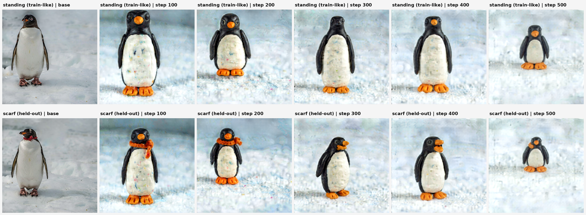

# Ideogram 4 LoRA Starter

A minimal, **uv-native** LoRA training + inference scaffold for the
[Ideogram 4](https://github.com/ideogram-oss/ideogram4) open weights.
Point it at a small image+caption folder, train a style LoRA, and generate
base-vs-LoRA comparisons.

> Unofficial, experimental, **non-commercial**. Not affiliated with Ideogram.



## Setup

Requires [uv](https://docs.astral.sh/uv/), Python ≥ 3.10, and a CUDA GPU
(the default weights are nf4 / CUDA-only).

```bash
uv sync
```

This pulls the upstream `ideogram-4` package from GitHub (model, loaders, VAE,
scheduler, Qwen3-VL text encoder).

### Hugging Face access

Weights are **gated**. Accept the license on the `ideogram-ai/ideogram-4-nf4`
model page, then authenticate:

```bash
uv run hf auth login 
```

No weights are bundled; the first run downloads them (~20GB) to your HF cache.

## Usage

One entry point: `ilora <command>` (or `python main.py <command>`). Run
`uv run ilora --help`, or `uv run ilora <command> --help` for options.

```bash
uv run ilora inspect

uv run ilora dataset --out ./dataset_penguin

uv run ilora train --data ./dataset_penguin --output ./runs/penguin_clay \
    --resolution 512 --rank 16 --alpha 8 --learning_rate 2e-4 \
    --target_modules attention_mlp --max_train_steps 500 --checkpoint_every 100

# ...or keep the params in a YAML file (CLI flags still override it):
uv run ilora train --config examples/configs/penguin.yaml
uv run ilora train --config examples/configs/penguin.yaml --max_train_steps 1000

uv run ilora sample --lora ./runs/penguin_clay --compare \
    --prompt examples/prompts/penguin.json --output ./examples/outputs/penguin

uv run ilora eval --run ./runs/penguin_clay

uv run ilora selftest
```

## Prompting

Ideogram 4 is trained on **structured JSON captions**, so they're the native,
in-distribution format, and notably more reliable: out-of-distribution
plain-text prompts can make the model emit a gray *"Image blocked by safety
filter"* placeholder. `sample.py` accepts a JSON string or a `.json`/`.txt`
file (it strips `aspect_ratio`, reorders keys, and validates), or plain text.
See `examples/prompts/penguin.json` for the schema:

```json
{"high_level_description":"...",
 "compositional_deconstruction":{"background":"... (scene shell only)",
   "elements":[{"type":"obj","desc":"... one subject per element ..."}]}}
```

## Roadmap

- Layer selection: train specific layer ranges or set per-layer rank/alpha, beyond the current module-family presets (which apply across all 34 layers).
- High-resolution training: validated 768/1024 presets plus the memory tricks (gradient checkpointing, latent bucketing) to make it practical past the 512 demo default.
- fp8 weights: use the `ideogram-4-fp8` build on H100 (FP8 tensor cores) for faster training and inference than the nf4 dequant path.

## License

The scaffold **code** is MIT (see `LICENSE`). It does not cover the Ideogram 4
**weights**, any **LoRA adapter** trained from them, or the model's **image
outputs**, which are all governed by Ideogram's **non-commercial** license;
review it before use. The bundled example images (`dataset_penguin/`,
`examples/`) are Ideogram 4 outputs under those terms. Unofficial; not
affiliated with Ideogram.
