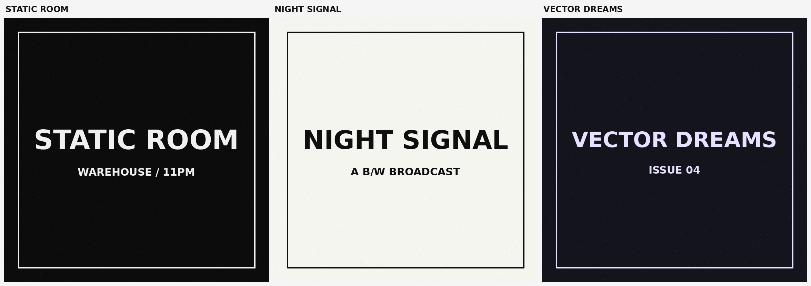

# Ideogram 4 LoRA Starter

A minimal **experimental** LoRA training + inference scaffold for the
[Ideogram 4](https://github.com/ideogram-oss/ideogram4) open weights.

> Clone it, point it at a small image+caption folder, train a style LoRA, and
> generate base-vs-LoRA comparison samples. That's the whole goal of v1.



## Status

Fresh-release, hacked-together, expect rough edges. Ideogram 4 dropped its open
weights on **2026-06-03**; this repo went up right after. It is unofficial and
not affiliated with Ideogram.

**What's verified:** the core mechanics — LoRA injection onto the real
transformer modules, base-frozen / adapter-only training, the flow-matching
loss, latent packing, and adapter save/reload — are checked by `selftest.py`
(runs on CPU, no weights needed).

**What's NOT yet verified by the authors:** a full end-to-end training run on
the real gated weights, and exact VRAM/quality numbers. The Ideogram 4 weights
are gated (~20GB), so we couldn't smoke-test the full loop here. If you run it,
please open an issue with what you saw. See [Known Issues](#known-issues).

## How this differs from a "normal" diffusers LoRA

Ideogram 4 is **not** a standard diffusers/PEFT model, so the usual scripts
won't work as-is. Things worth knowing:

| Expectation | Reality (read from the source) |
|---|---|
| `DiffusionPipeline.from_pretrained` | Bespoke `ideogram4.Ideogram4Pipeline` (plain `nn.Module`). |
| `attn.to_q / to_k / to_v / to_out` | Fused **`attention.qkv`** + **`attention.o`**; MLP **`feed_forward.w1/w2/w3`**, across **34** `layers`. |
| CLIP/T5 text encoder | **Qwen3-VL-8B-Instruct**, 13 hidden layers concatenated. |
| Standard ε/v-prediction | **Flow matching**: `x_t = (1-t)·noise + t·latent`, model predicts velocity `latent − noise`. |
| PEFT adapters | A tiny built-in LoRA (`lora.py`) that wraps the frozen `Linear4bit` (nf4) base directly. No PEFT dependency. |

`python inspect_model.py` prints the actual module names so you never have to
guess.

## Install

Requires Python ≥ 3.10 and a CUDA GPU (the default weights are nf4 / CUDA-only).

```bash
# with uv (recommended for devs)
uv sync

# or plain pip
pip install -r requirements.txt
```

This installs the upstream `ideogram4` package straight from GitHub, which
provides the model, loaders, VAE, scheduler, and text encoder.

## Hugging Face access

The weights are **gated and non-commercial**. You must:

1. Accept the license on the model page: `ideogram-ai/ideogram-4-nf4`.
2. Log in so the downloader can use your token:

```bash
huggingface-cli login        # paste a token from huggingface.co/settings/tokens
# or: export HF_TOKEN=hf_xxx
```

No weights are bundled in this repo. First run downloads them to your HF cache.

Sanity-check access and see the real module names:

```bash
python inspect_model.py
```

## Dataset format

Dead simple — an image and a same-named `.txt` caption:

```
my_dataset/
  0001.png
  0001.txt
  0002.jpg
  0002.txt
```

A small `dataset_example/` is included so you can run end-to-end immediately.

### JSON captions

Ideogram 4 was trained with structured captions. v1 does not build a captioning
pipeline — instead, you can just put JSON directly inside the `.txt` file and it
gets fed to the text encoder verbatim:

```json
{
  "description": "A vintage club flyer with high contrast typography.",
  "style": "grainy photocopied punk zine aesthetic",
  "text": [{"content": "STATIC ROOM", "placement": "center",
            "style": "large distorted uppercase lettering"}],
  "palette": ["#000000", "#ffffff", "#d8d8d8"]
}
```

Better JSON tooling may come later.

## Train

```bash
python train_lora.py \
  --model ideogram-ai/ideogram-4-nf4 \
  --data ./dataset_example \
  --output ./runs/test_lora \
  --resolution 1024 \
  --rank 16 \
  --learning_rate 1e-4 \
  --max_train_steps 500
```

The trainer pre-encodes all latents + text features once, then frees the text
encoder, VAE, and unconditional transformer before training — only the
conditional transformer (nf4) plus the LoRA adapter stay resident. Gradient
checkpointing is on by default.

Experimental defaults (tune freely):

| flag | default |
|---|---|
| `--resolution` | 1024 (drop to 512 if you OOM) |
| `--rank` / `--alpha` | 16 / 16 |
| `--learning_rate` | 1e-4 |
| `--gradient_accumulation_steps` | 4 |
| `--max_train_steps` | 500 |
| `--checkpoint_every` | 250 |
| `--target_modules` | `attention` (`attention_mlp` / `all_linear`, or a comma list like `attention.qkv,attention.o`) |

Output: `lora.safetensors` + `lora_config.json`.

## Generate

```bash
# base vs LoRA in one shot -> *_base.png, *_lora.png, *_comparison_grid.png
python sample.py --lora ./runs/test_lora --compare \
  --prompt 'a brutalist black and white poster that says "NIGHT SIGNAL"' \
  --output ./examples/outputs/night_signal

# single image, base or LoRA
python sample.py --prompt 'a vintage rave flyer that says "NO SIGNAL"' \
  --lora ./runs/test_lora --output ./samples/flyer.png
```

Make a grid from arbitrary images:

```bash
python make_grid.py --images base.png lora.png --labels Base LoRA \
  --output comparison_grid.png
```

## Before / After samples

Run `sample.py --compare` and drop the resulting `*_comparison_grid.png` here.
(Authors haven't published trained samples yet — see Status.)

## Self-test (no weights)

```bash
python selftest.py
```

Verifies patchify round-trips exactly, LoRA targets the right modules, the base
stays frozen, an optimizer step updates only the adapter, and save→reload
reproduces outputs.

## Known issues

- **Untested end-to-end on real weights.** Mechanics are unit-tested; the full
  gated-weights loop is not yet author-verified.
- **VRAM unverified.** Designed to fit a single ~40GB card at 1024px via latent
  caching + gradient checkpointing, but not benchmarked. Drop to `--resolution
  512` if you OOM.
- **Single GPU, batch size 1** (with gradient accumulation). No multi-GPU.
- **Square images only** in v1 (center-cropped). Ideogram 4 supports arbitrary
  aspect ratios; this scaffold doesn't expose that yet.
- The `dataset_example/` images are synthetic placeholders — replace them with a
  real, coherent style set for meaningful results.

## Roadmap (v2+)

JSON caption helper · OCR eval for generated text · better target presets ·
aspect-ratio buckets · caption auto-generation · HF adapter upload · ComfyUI
node · Gradio demo · multi-GPU · memory guide.

## License and usage notice

This project is an unofficial experimental LoRA training scaffold for Ideogram 4.

Ideogram 4 is released under the **Ideogram 4 Non-Commercial License**. This repo
does not grant any additional rights to Ideogram 4 weights, outputs, or
derivatives. LoRAs trained from Ideogram 4 may be considered model derivatives
and should follow the Ideogram 4 license terms. **Non-commercial / research /
personal use only.**

This project is not affiliated with, endorsed by, or validated by Ideogram. The
scaffold code is MIT-licensed (see `LICENSE`); that license covers only this
repository's code, not the weights.
